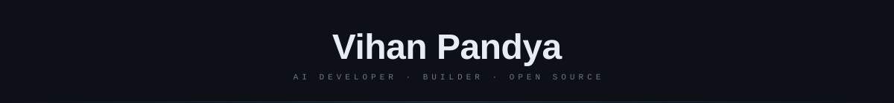

<div align="center">

[](https://git.io/typing-svg)

</div>

---


### `> whoami`

```python
class VihanPandya:
    name       = "Vihan Pandya"
    location   = "India 🇮🇳"
    role       = "AI Developer"
    focus      = ["LLMs", "Neural Architectures", "AI Tooling"]
    building   = "Open Brain (Meridian)"
    email      = "vihanpandya01@gmail.com"
    open_to    = ["Collaborations", "Open Source", "Cool Ideas"]

    def say_hi(self):
        print("Thanks for stopping by! Let's build something great.")
```

<br clear="right"/>

---

### What I'm Up To

- 🔭 Building **Open Brain (Meridian)** — an open AI research platform
- 🧠 Exploring **LLMs, transformers, and multi-modal architectures**
- 🛠️ Experimenting with **AI agents and autonomous systems**
- 📖 Always reading research papers and shipping side projects
- 💬 Ask me anything about **AI/ML, Python, or what I'm building**

---

### 🔬 What I'm Building

<table>
<tr>
<td valign="top" width="62%">

**Open Brain — Meridian**

An open-source AI research platform for experimenting with LLMs, custom transformer architectures, and autonomous agent systems. Built to give independent researchers the same capabilities as well-funded labs — no $10k GPU budget required.

`PyTorch` · `Transformers` · `CUDA` · `Python` · `Custom training pipelines`

**Status:** 🔨 Active development &nbsp;|&nbsp;
</td>
<td valign="top" align="center" width="38%">

```python
model = Meridian(
    arch    = "transformer",
    scale   = "7B",
    mode    = "research",
    spirit  = "open_forever",
)
model.think()
# > cognition initialized ✓
```

</td>
</tr>
</table>

---

### Connect With Me

<p align="left">
  <a href="https://linkedin.com/in/vihanpandya" target="_blank">
    
  </a>
  <a href="https://discord.gg/vihanpandya" target="_blank">
    
  </a>
  <a href="mailto:vihanpandya01@gmail.com">
    
  </a>
</p>

---

### Languages & Tools

<div align="center">
  
</div>

---


<div align="center">

*"The best way to predict the future is to build it."*


</div>


